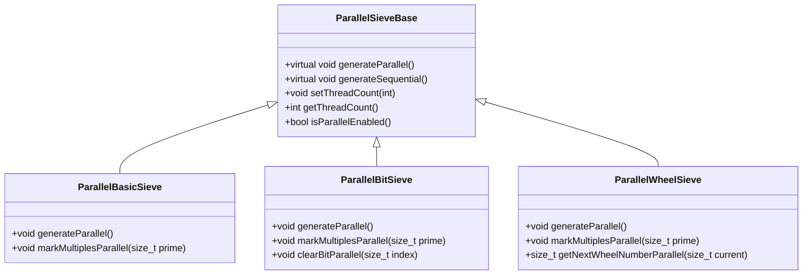

# OpenMP Parallelization Plan for Prime Number Sieves

## Overview

This document outlines a comprehensive plan to implement OpenMP parallel processing for all three sieve implementations (BasicSieve, BitSieve, WheelSieve) while maintaining backward compatibility with existing sequential versions.

## Architecture Design

### Parallelization Strategy

We'll use a **work-sharing approach** where the range is divided among threads for better cache locality:

1. **BasicSieve**: Divide the marking loop iterations among threads
2. **BitSieve**: Parallelize bit marking operations with careful synchronization
3. **WheelSieve**: Parallelize wheel-based marking while preserving wheel optimization

### Implementation Approach



## Detailed Implementation Plan

### Phase 1: Foundation and Analysis

#### 1.1 Analyze Existing Implementations
- Identify parallelization bottlenecks in current sieve algorithms
- Determine optimal parallelization points for each sieve type
- Analyze memory access patterns for cache efficiency

#### 1.2 Design Parallel Base Class
- Create abstract `ParallelSieveBase` class with common OpenMP functionality
- Implement thread management and configuration
- Add performance monitoring capabilities
- Ensure backward compatibility with sequential versions

### Phase 2: Core Implementation

#### 2.1 Parallel BasicSieve Implementation
```cpp
class ParallelBasicSieve : public BasicSieve, public ParallelSieveBase {
private:
    int threadCount;
    bool useParallel;
    
public:
    explicit ParallelBasicSieve(std::size_t n, int threads = 0);
    void generate() override;
    
private:
    void markMultiplesParallel(std::size_t prime);
};
```

**Key parallelization points:**
- Divide prime marking loop among threads
- Each thread handles a range of multiples
- Use `#pragma omp parallel for` for marking operations
- Ensure thread-safe access to sieve array

#### 2.2 Parallel BitSieve Implementation
```cpp
class ParallelBitSieve : public BitSieve, public ParallelSieveBase {
private:
    int threadCount;
    bool useParallel;
    
public:
    explicit ParallelBitSieve(std::size_t n, int threads = 0);
    void generate() override;
    
private:
    void markMultiplesParallel(std::size_t prime);
    void clearBitParallel(std::size_t index);
};
```

**Key parallelization points:**
- Parallel bit marking with atomic operations where needed
- Divide bit array among threads to minimize false sharing
- Use `#pragma omp parallel for` for bit manipulation
- Optimize memory access patterns for cache efficiency

#### 2.3 Parallel WheelSieve Implementation
```cpp
class ParallelWheelSieve : public WheelSieve, public ParallelSieveBase {
private:
    int threadCount;
    bool useParallel;
    
public:
    explicit ParallelWheelSieve(std::size_t n, int threads = 0);
    void generate() override;
    
private:
    void markMultiplesParallel(std::size_t prime);
    std::size_t getNextWheelNumberParallel(std::size_t current);
};
```

**Key parallelization points:**
- Parallel wheel-based marking while preserving wheel optimization
- Divide wheel iterations among threads
- Maintain wheel synchronization across threads
- Optimize for the 2,3,5-wheel pattern

### Phase 3: Thread Management

#### 3.1 Automatic Core Detection
```cpp
int getOptimalThreadCount() {
    int maxThreads = omp_get_max_threads();
    int logicalCores = std::thread::hardware_concurrency();
    return std::min(maxThreads, logicalCores);
}
```

#### 3.2 Thread Configuration
- Support automatic detection (default behavior)
- Allow manual override via command-line arguments
- Implement fallback to sequential if threads = 1
- Add runtime thread count validation

### Phase 4: Command-Line Interface

#### 4.1 New Command-Line Options
```bash
--parallel              # Enable parallel processing (default)
--no-parallel           # Disable parallel processing
--threads N             # Specify number of threads (auto-detect if not specified)
--thread-info           # Display thread information and exit
```

#### 4.2 Integration with Existing CLI
- Extend existing CLI11 setup
- Maintain backward compatibility
- Add parallel processing information to output
- Update help text and examples

### Phase 5: Performance Optimization

#### 5.1 Memory Access Patterns
- Optimize for cache-friendly access
- Minimize false sharing between threads
- Use appropriate OpenMP scheduling (static vs dynamic)
- Implement memory alignment optimizations

#### 5.2 Load Balancing
- Implement dynamic scheduling for irregular workloads
- Use guided scheduling for adaptive behavior
- Add chunk size optimization
- Monitor thread workload distribution

### Phase 6: Build System Integration

#### 6.1 CMakeLists.txt Updates
```cmake
# Ensure OpenMP is properly found and linked
find_package(OpenMP REQUIRED)
if(OpenMP_CXX_FOUND)
    target_compile_options(prime_sieve PRIVATE OpenMP::OpenMP_CXX_FLAGS)
    target_link_libraries(prime_sieve PRIVATE OpenMP::OpenMP_CXX)
endif()
```

#### 6.2 Compiler Flags
- Add OpenMP support detection
- Ensure proper compiler flags are set
- Add conditional compilation for OpenMP availability
- Maintain compatibility with non-OpenMP builds

### Phase 7: Testing and Benchmarking

#### 7.1 Performance Benchmarks
```cpp
struct BenchmarkResult {
    std::size_t limit;
    int threadCount;
    double sequentialTime;
    double parallelTime;
    double speedup;
    std::size_t memoryUsage;
};
```

#### 7.2 Test Scenarios
- Small ranges (10^6): Measure overhead
- Medium ranges (10^8): Optimize performance
- Large ranges (10^9): Maximize scalability
- Thread scaling tests (1, 2, 4, 8, 16 threads)

### Phase 8: Documentation

#### 8.1 User Documentation
- Update README.md with parallel processing examples
- Add performance expectations
- Include thread configuration guidelines
- Document limitations and best practices

#### 8.2 Developer Documentation
- Add parallelization design notes
- Document OpenMP usage patterns
- Include performance tuning guidelines
- Add troubleshooting section

## Implementation Details

### OpenMP Directives to Use

1. **Parallel For Loops**:
```cpp
#pragma omp parallel for schedule(static, chunk_size)
```

2. **Critical Sections**:
```cpp
#pragma omp critical
```

3. **Barrier Synchronization**:
```cpp
#pragma omp barrier
```

4. **Reduction Operations**:
```cpp
#pragma omp parallel for reduction(+:counter)
```

### Memory Considerations

1. **False Sharing Prevention**:
   - Pad thread-local data
   - Use appropriate cache line sizes
   - Align data structures

2. **NUMA Awareness**:
   - Consider NUMA topology
   - Use first-touch policy
   - Optimize memory allocation

3. **Cache Efficiency**:
   - Optimize access patterns
   - Use appropriate data structures
   - Minimize cache misses

### Performance Targets

| Range Size | Target Speedup | Threads |
|-------------|----------------|----------|
| 10^6        | 1.5-2.0x       | 2-4      |
| 10^8        | 2.5-3.5x       | 4-8      |
| 10^9        | 3.0-4.0x       | 8-16     |

### Backward Compatibility

1. **Sequential Fallback**:
   - All parallel classes inherit from sequential versions
   - Automatic fallback when threads = 1
   - Preserve existing API

2. **Feature Flags**:
   - Runtime detection of OpenMP availability
   - Graceful degradation without OpenMP
   - Clear error messages

## Implementation Timeline

### Week 1: Foundation
- Day 1-2: Analyze existing code and design base class
- Day 3-4: Implement ParallelSieveBase class
- Day 5-7: Add thread management and configuration

### Week 2: Core Implementation
- Day 1-3: Implement ParallelBasicSieve
- Day 4-5: Implement ParallelBitSieve
- Day 6-7: Implement ParallelWheelSieve

### Week 3: Integration and Testing
- Day 1-2: Update command-line interface
- Day 3-4: Update build system
- Day 5-7: Create benchmarks and tests

### Week 4: Optimization and Documentation
- Day 1-3: Performance optimization and tuning
- Day 4-5: Documentation updates
- Day 6-7: Final testing and validation

## Success Criteria

1. **Functional Requirements**:
   - All three sieve types work in parallel
   - Automatic core detection and configuration
   - Backward compatibility maintained
   - No functional regressions

2. **Performance Requirements**:
   - Achieve target speedups in benchmarks
   - Scalable performance across thread counts
   - Low overhead for small ranges
   - Efficient memory usage

3. **Quality Requirements**:
   - Thread-safe implementations
   - Proper error handling
   - Comprehensive test coverage
   - Clear documentation

## Risk Mitigation

1. **Performance Risks**:
   - Overhead for small ranges
   - Thread contention issues
   - Memory bandwidth limitations
   - Cache coherence problems

2. **Compatibility Risks**:
   - OpenMP availability issues
   - Compiler compatibility
   - Platform-specific behavior
   - Runtime library conflicts

3. **Mitigation Strategies**:
   - Comprehensive testing across platforms
   - Fallback mechanisms
   - Performance monitoring
   - Clear error reporting

This plan provides a comprehensive approach to implementing OpenMP parallelization while maintaining the existing functionality and ensuring optimal performance across different hardware configurations.